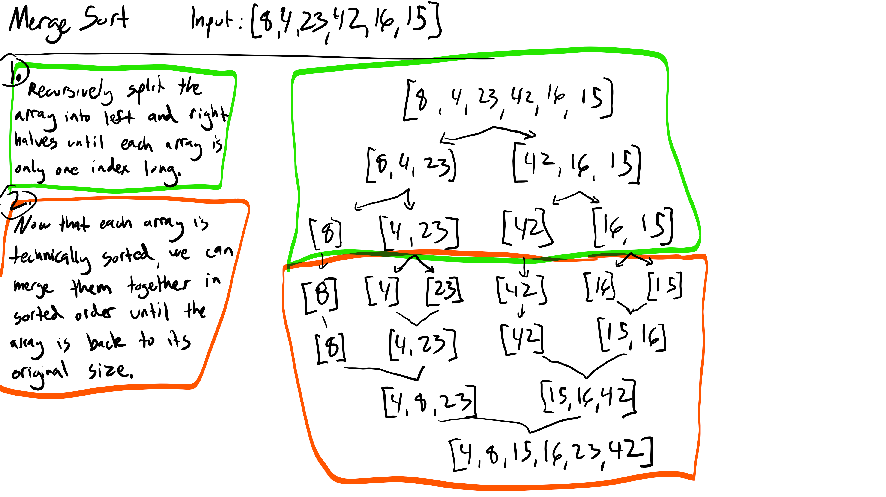
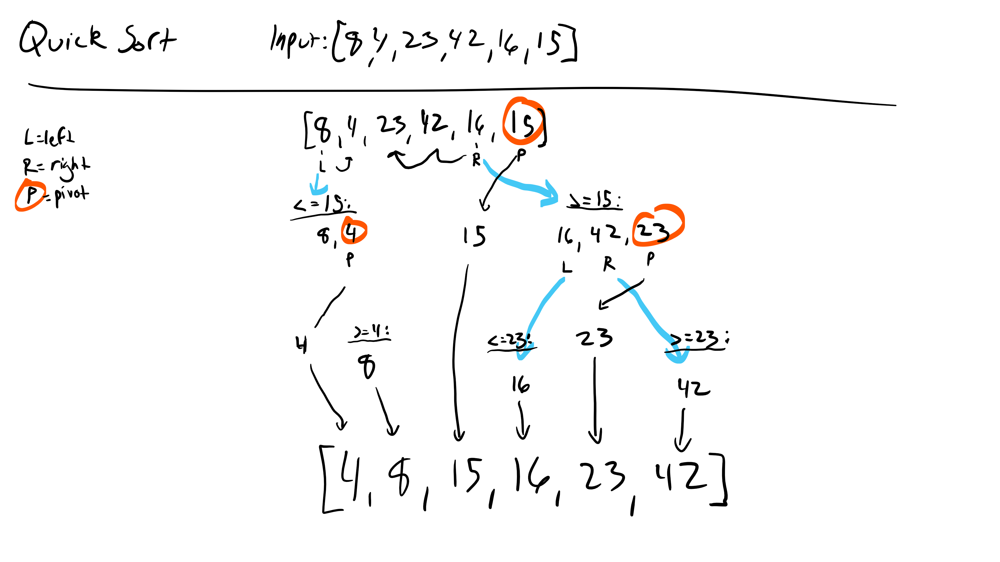

# Insertion Sort
This sorting method works by iterating through the array from left to right and maintaining a sorted, growing portion of the array until the entire array has been checked.

## Algorithm
1. Loop through the entire array.
2. Keep track of two adjacent values, starting at index 0. (j and i).
3. Store the value of i in a 'temp' variable at every loop.
4. Inside the loop, whenever j is greater than i, i is not in the correct position. To find it's proper position, loop towards index 0, moving each value to the right, until a value is found that is less than j. Then insert the temp value at j + 1.

## Pseudo Code
  
    FOR i = 1 to arr.length
    
      int j <-- i - 1
      int temp <-- arr[i]
      
      WHILE j >= 0 AND temp < arr[j]
        arr[j + 1] <-- arr[j]
        j <-- j - 1
        
      arr[j + 1] <-- temp

## Whiteboard step-through example

## Approach and Efficiency
This approach loops through the entire array once, with the potential to loop through the array again at each iteration n-i times, making it O(n squared/2) for time complexity, or O(n squared). No additional data structure is created during the sort, making it O(1) for space complexity.

## Code

# Merge Sort
This sorting method works by using a helper method to recursively split the array into left and right halves until each array has a single index, then sort and combine them until the array is back to its original size.

## Algorithm
Define the recursive helper method, which
  1. Splits the input array into left and right halves
  2. Recursively splits each half using itself
  3. Uses the merge method to combine the two sorted array halves once they've been split to be one index long

Define the merge method, which
  1. Iterates through either sorted array
  2. Compares the values of each and inserts them into a new array in sorted order
  3. If either left or right is longer than the other, adds the rest of its values to the original.

## Pseudo Code
  
    ALGORITHM Mergesort(arr)
    DECLARE n <-- arr.length
           
    if n > 1
      DECLARE mid <-- n/2
      DECLARE left <-- arr[0...mid]
      DECLARE right <-- arr[mid...n]
      // sort the left side
      Mergesort(left)
      // sort the right side
      Mergesort(right)
      // merge the sorted left and right sides together
      Merge(left, right, arr)

ALGORITHM Merge(left, right, arr)
    DECLARE i <-- 0
    DECLARE j <-- 0
    DECLARE k <-- 0

    while i < left.length && j < right.length
        if left[i] <= right[j]
            arr[k] <-- left[i]
            i <-- i + 1
        else
            arr[k] <-- right[j]
            j <-- j + 1
            
        k <-- k + 1

    if i = left.length
       set remaining entries in arr to remaining values in right
    else
       set remaining entries in arr to remaining values in left

## Whiteboard step-through example
<!-- Thanks to https://www.geeksforgeeks.org/merge-sort/ for the great visual. -->

## Approach and Efficiency
This approach splits the input array in half log(n) times, creating n arrays. It then iterates over each array, combining them. The resulting time complexity is Olg(n) * (n-1), which is essentially O(n). This requires a new array to be created at every step, giving it the same space complexity, Olg(n) * (n-1), or O(n).

## Code

# Quick Sort
This sorting method works by recursively declaring a value in the array as the 'pivot' and moving all values less than the pivot into a 'left' section, and all greater values into a 'right' section, until all values have been sorted. This version uses a main method, a recurisve partitioning method, and a swap method to accomplish this.

## Algorithm
The Quicksort method accepts the array and the left and right bounds that need to be sorted. Within this method the Partition method is called to divide the array and sort via a pivot value, then this Quicksort method is recursively called on the sections of the array on each side of the pivot value. 

The Partition method takes the rightmost value in the array to use as the pivot value, uses two variables to iterate from the ends of the array towards the center, and uses the Swap method to swap values as necessary so that all values left of the pivot are less than or equal to the pivot value and vice versa.

## Pseudo Code
QuickSort(arr, left, right)
    if left < right
        // Partition the array by setting the position of the pivot value 
        DEFINE position <-- Partition(arr, left, right)
        // Sort the left
        QuickSort(arr, left, position - 1)
        // Sort the right
        QuickSort(arr, position + 1, right)

Partition(arr, left, right)
    // set a pivot value as a point of reference
    DEFINE pivot <-- arr[right]
    // create a variable to track the largest index of numbers lower than the defined pivot
    DEFINE low <-- left - 1
    for i <- left to right do
        if arr[i] <= pivot
            low++
            Swap(arr, i, low)

     // place the value of the pivot location in the middle.
     // all numbers smaller than the pivot are on the left, larger on the right. 
     Swap(arr, right, low + 1)
    // return the pivot index point
     return low + 1

Swap(arr, i, low)
    DEFINE temp;
    temp <-- arr[i]
    arr[i] <-- arr[low]
    arr[low] <-- temp

## Whiteboard step-through example

## Approach and Efficiency
This approach has a time complexity between O(n * log n) and O(n * n) depending on the pivot selected, because if the pivot is the smallest or largest value in the array, values will need to be swapped at every iteration. For the same reason it has a space complexity between O(log n) and O(n), because in the worst case a recurisve Partition method call is made at every element.

## Code

