This is the repo used for the Code Fellows 301 and 401 Code Challenges.
Author: Lucas Wilber

# Reverse an Array

## Challenge
Write a Java method that takes in an array and returns the reverse.

## Approach & Efficiency
My approach was to iterate backwards over the inputted array and define the values of the new array in order with each iteration.

## Solution
[code](./code401challenges/src/main/java/code401challenges/java/ArrayReverse.java)

# Shift an Array

## Challenge
Write a function called insertShiftArray which takes in an array and the value to be added. Without utilizing any of the built-in methods available, return an array with the new value added at the middle index.

## Approach & Efficiency
My approach was to create an empty array with a length of the inputted array + 1, then iterate over it, skipping the middle index while adding the values from the inputted array, then finally setting the middle index to be the inputted value.

## Solution
[code](./code401challenges/src/main/java/code401challenges/java/ArrayShift.java)
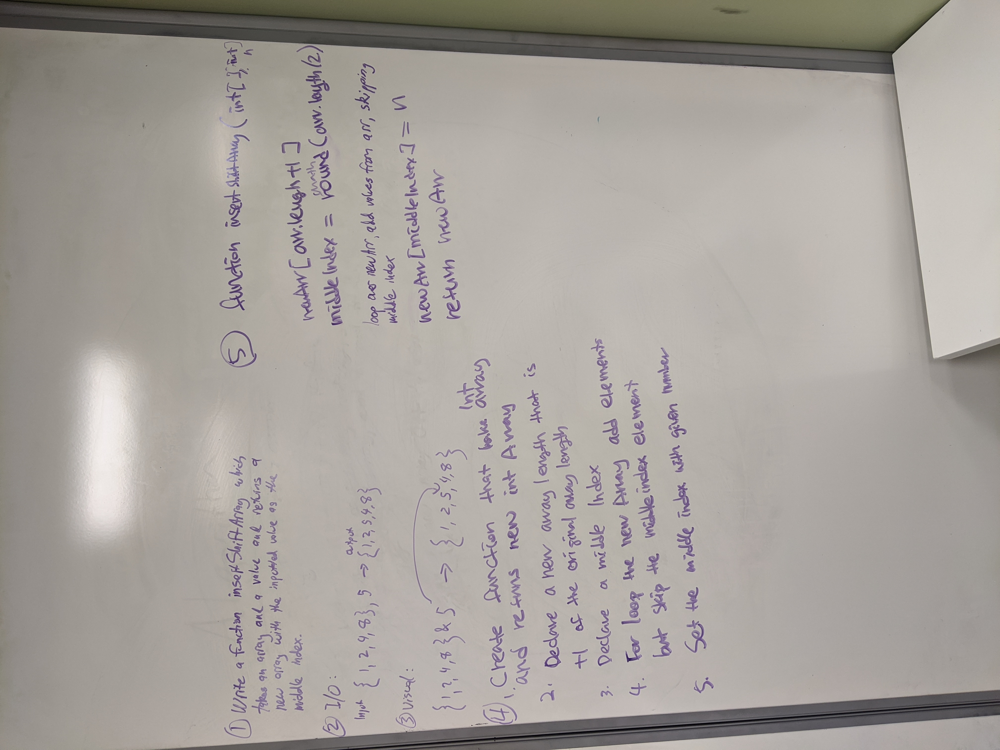

# Array Binary Search

## Challenge
Write a function called BinarySearch which takes in 2 parameters: a sorted array and the search key. Without utilizing any of the built-in methods, return the index of the array’s element that is equal to the search key, or -1 if the element does not exist.

## Approach & Efficiency
My approach was to start at the middle by taking the input array length / 2, then begin a while-loop where I compare the value at that index to the search key and keep track of the index of comparison. If the search key wasn't found, I add or subtract half of the difference between the input array length and the tracked index value to the index value, which continuously halves the current index value while moving towards the search key. If the maximum or minimum index values are reached and the search key isn't found, I return -1;

## Solution
[code](./code401challenges/src/main/java/code401challenges/java/BinarySearch.java)

# Linked List

## Challenge
Create a linked list class, with a method that adds a new Node to the head of the list. Add methods to insert a node before and after a node with a given value, and at the end of the list. Add a method that converts the list into a string of Node values. Add a method that returns true or false if a given value exists in the Linked List.

## Approach & Efficiency
My approach inserts new nodes at the head of the list, so that inserting new nodes is O(1) rather than O(n).

## Methods

-`insert(int value)` Inserts a new Node into the Linked List 

-`includes(int input)` Checks the value of each Node in the list agains the input and returns true if found, false if not. 

-`[Node].listToString()` Prints each value of the Linked List starting at the specified Node in "{ [Node value] } -> { [next Node value] } ->..." format. Call it on the head to print the entire list.

-`append(int value)` Inserts a new Node at the end of the list.

-`insertBefore(int value, int newVal)` Uses includes() to check if `value` exists in the LL, and if it does, inserts a new Node with value `newVal` before it.

-`insertAfter(int value, int newVal)` Uses includes() to check if `value` exists in the LL, and if it does, inserts a new Node with value `newVal` after it.

## Solution
[code](./code401challenges/src/main/java/LinkedList/java/LinkedList.java)
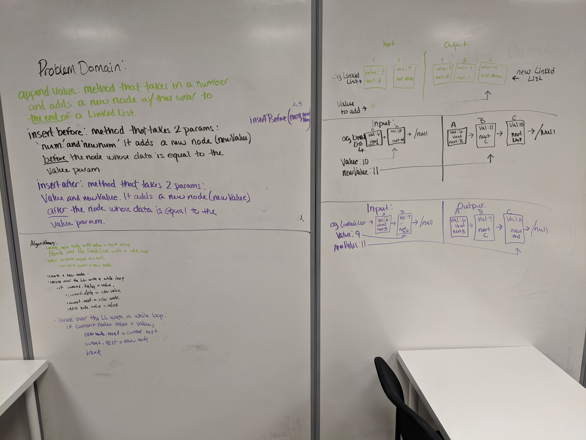

# Linked List - kth From End

## Challenge
Write a method that, given a value `k`, finds the `k`th Node from the end of the Linked List, where the Linked List has a 0-based length.

## Approach & Efficiency
I first wrote a two-pass method that gets the length of the list on the first iteration, then iterates through again (length - k) times to arrive at the kth-from-the-end Node. I also wrote a one-pass method that creates an array of `k` length and at each iteration updates the indicies of the array to represent a segment of the last `k` values iterated over. When the loop reaches the end of the Linked List, index 0 of the array is the kth-from-the-end Node value.

## Methods

-`kthFromEnd(int k)` Returns the value of the Node `k` from the end of the Linked List. O(2n)/time, O(1) space.
-`onePassKthFromEnd(int k)` Returns the value of the Node `k` from the end of the Linked List. O(n) time, O(`k` + 1) space.

## Solution
[code](./code401challenges/src/main/java/LinkedList/java/LinkedList.java)
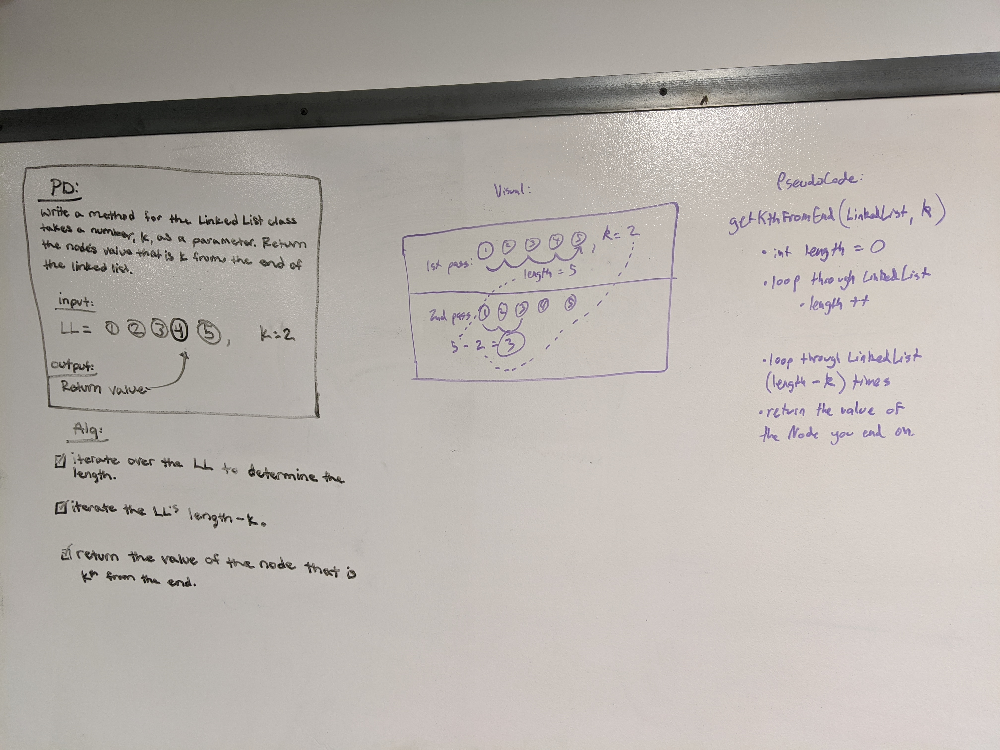

# Linked List - kth From End

## Challenge
Write a method that accepts two LinkedLists as arguments and merges them together in a zipper-fashion, eg (1)->(3)->(5) and (2)->(4)->(6) becomes (1)->(2)->(3)->(4)->(5)->(6).

## Approach & Efficiency
I store each Node in two variables: 'current' and 'previous', where they both are set to the list's head at first. Then, using a while loop I 

  1. advance each of the 'current' Nodes to their next node,
  
  2. set the first 'previous' Node to point to the second 'previous' Node and the second 'previous' Node to point to the first 'current' Node,

  3. set each 'previous' Node to the respective 'current' Node.

This is an O(n) time/O(1) space solution.

## Methods

-`mergeLists(LinkedList one, LinkedList two)` Zipper-merges the two lists together by moving Nodes in LL `two` into every other position in LL `one`. Returns the updated LL `one`.

## Solution
[code](./code401challenges/src/main/java/LinkedList/java/LinkedList.java)
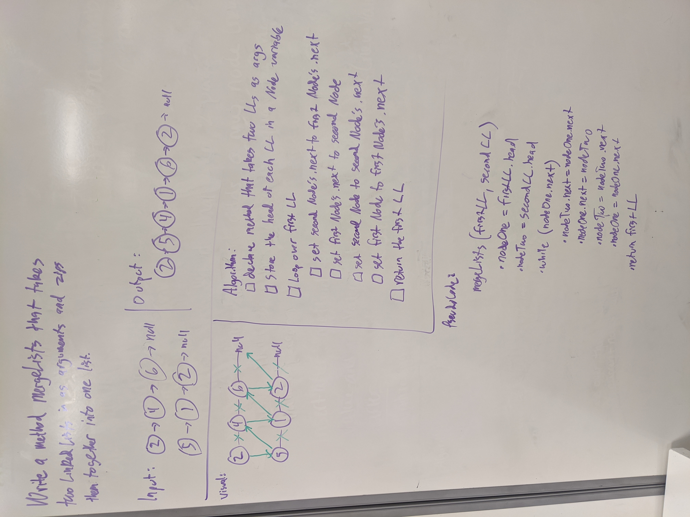

# Stacks and Queues
Two data structures based on linked lists. A stack is a First In, Last out linked list that inserts at the 'top' via the push() method and removes at the top via the pop() method. A queue is a linked list that adds at the 'rear' via the enqueue() method and removes at the 'front' via the dequeue() method. A queue maintains a First In, First Out order.

## Challenge
Create a Node class that has properties for the value stored in the Node, and a pointer to the next node.
Create a Stack class that has a top property. It creates an empty Stack when instantiated.
This object should be aware of a default empty value assigned to top when the stack is created.
Define a method called push which takes any value as an argument and adds a new node with that value to the top of the stack with an O(1) Time performance.
Define a method called pop that does not take any argument, removes the node from the top of the stack, and returns the node’s value.
Define a method called peek that does not take an argument and returns the value of the node located on top of the stack, without removing it from the stack.
Define a method called isEmpty that does not take an argument, and returns a boolean indicating whether or not the stack is empty.
Create a Queue class that has a front property. It creates an empty Queue when instantiated.
This object should be aware of a default empty value assigned to front when the queue is created.
Define a method called enqueue which takes any value as an argument and adds a new node with that value to the back of the queue with an O(1) Time performance.
Define a method called dequeue that does not take any argument, removes the node from the front of the queue, and returns the node’s value.
Define a method called peek that does not take an argument and returns the value of the node located in the front of the queue, without removing it from the queue.
Define a method called isEmpty that does not take an argument, and returns a boolean indicating whether or not the queue is empty.

## Approach & Efficiency
I used a similar approach to what I used in my Linked List classes. The stack and queue both insert and remove Nodes at O(1).

## API
Stack:
  -`push(int value)` Adds a new Node to the top of the stack with the given value.

  -`pop()` Removes the top Node from the stack and returns its value.

  -`peek()` Returns the value of the top Node in the stack. Throws a Null Pointer Exception if the stack is empty.

  -`isEmpty()` Returns true if the stack is empty, else false.

Queue:
  -`enqueue(int value)` Adds a new Node to the rear of the queue with the given value.

  -`dequeue()` Removes the front Node from the queue and returns its value.

  -`peek()` Returns the value of the front Node in the queue. Throws a Null Pointer Exception if the queue is empty.

  -`isEmpty()` Returns true if the queue is empty, else false.

# PseudoQueue

## Challenge
  Implement a Queue with enqueue() and dequeue() methods using two Stacks, with only Stack methods.

## Approach and Efficiency
  My approach was to set the 'front' and 'rear' properties of the PseudoQueue to be separate Stacks. When enqueuing I can simply push to the rear stack, but in order to push to the end of the front stack I need to reverse it first, then un-reverse it after. I had the opposite approach to dequeuing: the front Stack can simply be popped, but the rear Stack needs to be reversed in order to pop() the last Node, then un-reversed to re-set the order.

## API
  -`enqueue(int value)` Adds a new Node with the given value to the top of the front Stack and the rear of the Rear stack.

  -`dequeue(int value)` Removes the top Node from the front stack and the rear Node from the rear stack.

## Solution
  [code](./stacksandqueues/src/main/java/stacksandqueues/PseudoQueue.java)
  
  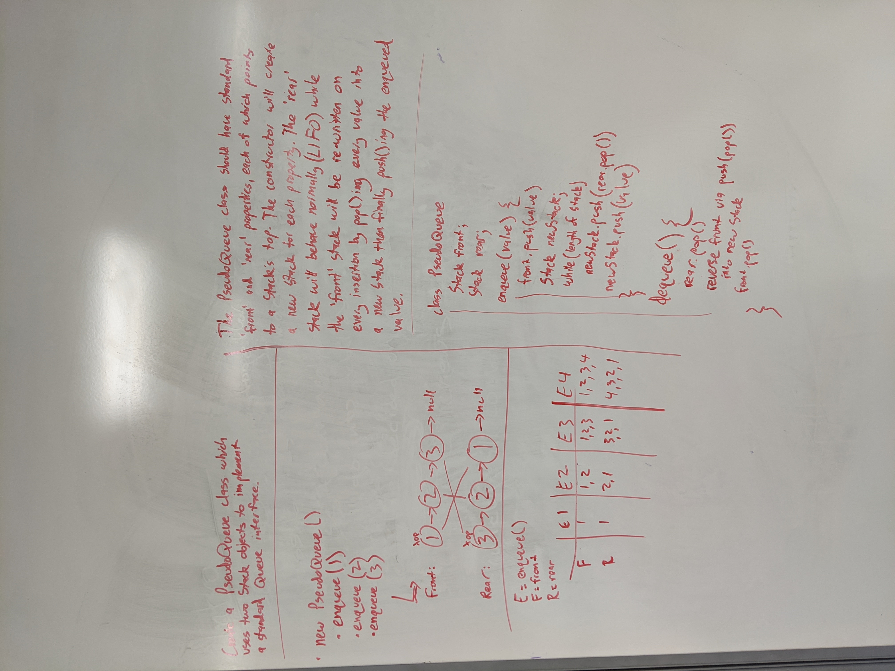

# Animal Shelter

## Challenge
  Implement a class named AnimalShelter holds Cats and Dogs in a FIFO fashion. The enqueue and dequeue methods can return either a Cat or Dog based on the argument.

## Approach and Efficiency
  My approach was to basically implement two separate queues in the class; one for Dogs, one for Cats. Based on the String argument given to enqueue() and dequeue() it adds or removes a Dog or a Cat, or null if neither is specified.

  Both enqueue() and dequeue() have O(1) time efficiency and O(1) space efficiency because they use standard queue methods and there are separate queues for Cats and Dogs.

## API
  -`enqueue(T animal)` If animal is a Cat, updates the Cat queue (frontCat, rearCat). If animal is a Dog, updates the Dog queue (frontDog, rearDog).

  -`dequeue(String preference)` If preference is "dog", removes the oldest Dog object from the dog queue and returns its name. If preference is "cat", removes the oldest Cat object from the queue and returns its name. If preference is neither "dog" nor "cat", returns null.

## Solution
  [code](./utilities/src/main/java/utilities/AnimalShelter.java)

  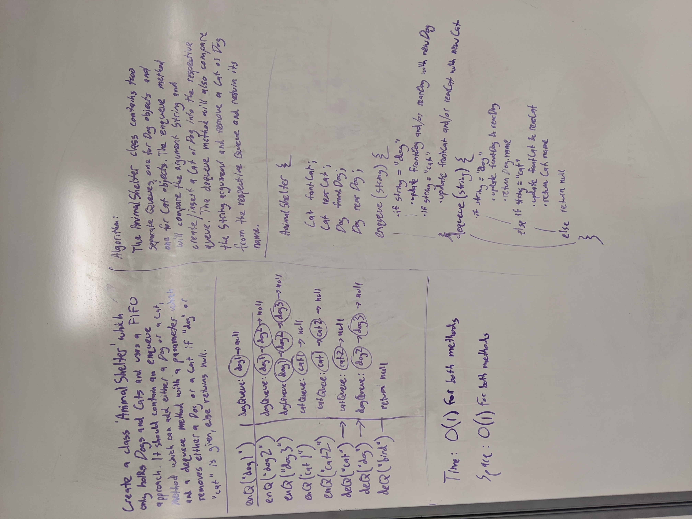

# Multi Bracket Validation

## Challenge
  Implement a method `multiBracketValidation(String input)` which accepts a string of brackets and returns true or false based on whether or not the string is balanced--whether it has a syntactically correct order of opening and closing brackets.

## Approach and Efficiency
  There are two things I needed to keep track of with my implementation: whether or not each bracket type has an equal number of openers and closers, and whether each closing bracket was preceded by the correct opening bracket. For the first problem I use a counter variable for each bracket type and as I iterate over the string I increment/decrement the variable whenever the corresponding bracket is found. If any counter ever becomes negative, I can return false immediately. For the second problem I use a Stack to keep track of every opening bracket, and whenever a closing bracket is found, I compare it to the top of the stack. If they aren't equal, I return false immediately, otherwise I pop off the top of the stack and continue iteration. Finally, after iterating through the entire string I return true if all my counter variables are 0, else false.
  Because this solution uses a Stack which only ever needs to peek() the top element, it has an O(1) space complexity. However since it needs to iterate through the entire input string once, it has an O(n) time complexity.

## API
  -`multiBracketValidation(String input)` Returns true if the input string has a balanced number and ordering of brackets, else returns false.

## Solution
  [code](./utilities/src/main/java/utilities/MultiBracketValidation.java)

  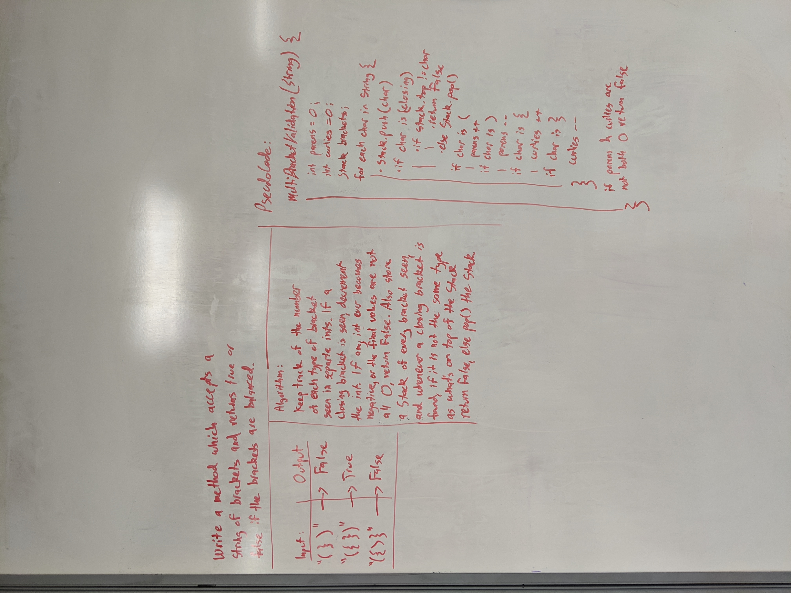

# Trees
Binary Search Tree

## Challenge
Create a class BinaryTree with methods which return an array of all Nodes in the tree in pre-order, in-order, and post-order. Create a BinarySearchTree class with a method to add Nodes in the correct order and a method to find if the tree contains a given value.

## Approach & Efficiency
For the BinaryTree methods I used an ArrayList to easily collect all Nodes in the tree in a specific order. I varied the order of statements in the recursively-called List building methods to fill the list, then convert it into an Array with the .toArray() method before returning it.

To add Nodes to the BinarySearchTree I recursively traverse through the tree comparing Node values with the given value until a Node is found which doesn't have a left or right Node and is less than/greater than the given value, respectively. Then that Node's left/right property is updated to be a new Node with the given value.

To check if a BinarySearchTree contains a given value I simply use the built in Array.contains() method to check if the arrary returned by my preOrder method contains the given value.

## API

  ### BinaryTree
    -`preOrder(BinarySearchTree tree)` Returns an array of the tree's values in a pre-order format.

    -`inOrder(BinarySearchTree tree)` Returns an array of the tree's values in an in-order format.

    -`postOrder(BinarySearchTree tree)` Returns an array of the tree's values in a post-order format.

  ### BinarySearchTree
    -`add(int value)` Inserts a Node with the given value in a position that maintains a left-to-right order throughout the BinarySearchTree

    -`contains(int value)` Returns true or false if the given value is in the BinarySearchTree

# Fizz Buzz Tree
Fizz-Buzz a Tree

## Challenge
Create a method FizzBuzzTree which accepts a Binary Search Tree as an argument and returns a new tree with the same structure, where all values have been replaced according to the rules of Fizz Buzz.

## Approach & Efficiency
My approach was to first create two helper methods, one with accepts a number and returns a String of "Fizz", "Buzz", "FizzBuzz", or "number" based on the value, and the other which recursively iterates through the given tree in a post-order fashion and creates new Nodes with fizz-buzz-ified values. In the FizzBuzzTree method I first create a new empty Fizzbuzz tree, then if the given tree's root is not null I create a root for the Fizzbuzz tree, and pass both roots into the recursive tree-copying method. Whenever a new Node is created for the FizzbuzzTree, its value gets what is returned when the corresponding old tree's Node value is passed through the fizzbuzzifier method.

## API

  -`FizzBuzzTree(BinarySearchTree tree)` Returns a new tree with the same structure as the input tree, but with all values stringified and replaced with "Fizz", "Buzz", or "FizzBuzz" if they are divisible by 3, 5, or 15 respectively.

## Solution
  [code](./utilities/src/main/java/utilities/FizzbuzzTree.java)

  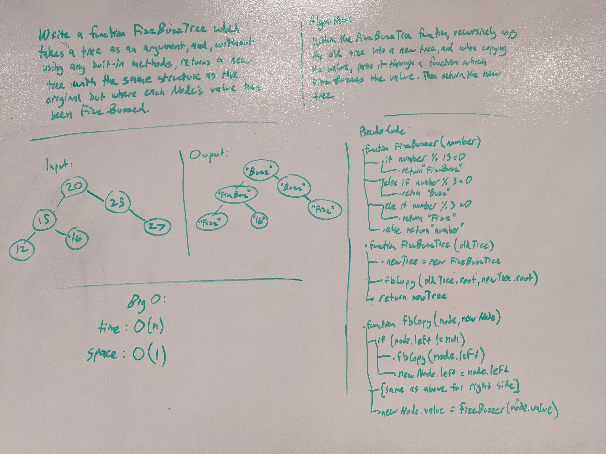

# Breadth First Traversal

## Challenge
Write a method that accepts a binary tree and returns the maximum value in the tree.

## Approach & Efficiency
Every Node's value needs to be checked so the best solution is O(n) for time. My solution is very similar to my breadth-first traversal method, but instead of adding each value to a List I compare it to a stored 'maxValue' integer and update it if necessary.

## API

  -`findMaximumValue(BinarySearchTree tree)` Returns an int of the maximum Node value in the tree.

## Solution
  [code](./utilities/src/main/java/utilities/BinaryTree.java)

  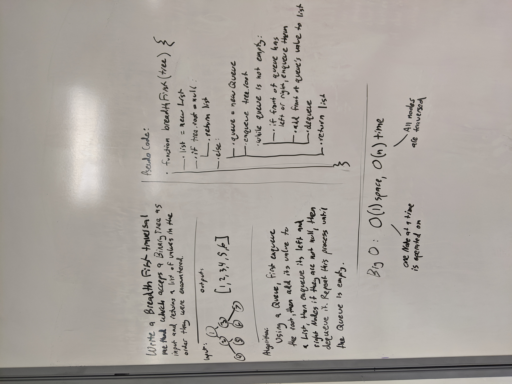

# Find Max Value

## Challenge
Write a breadth first traversal method which takes a Binary Tree as its unique input. Without utilizing any of the built-in methods available to your language, traverse the input tree using a Breadth-first approach, and return a list of the values in the tree in the order they were encountered.

## Approach & Efficiency
My approach for this method is to use Queue. First I add the tree's root Node to the front of the queue, then in a loop that runs until the queue is empty, I remove the Node at the front of the queue, add its left and right Nodes if it has either, and add its value to a List. This method only handles one Node at a time while traversing the entire tree by necessity, which makes it O(1) for space and O(n) for time.

## API

  -`breadthFirst(BinarySearchTree tree)` Returns a List of Integers of each Node in the tree, in a breadth-first order.

## Solution
  [code](./utilities/src/main/java/utilities/BinaryTree.java)

  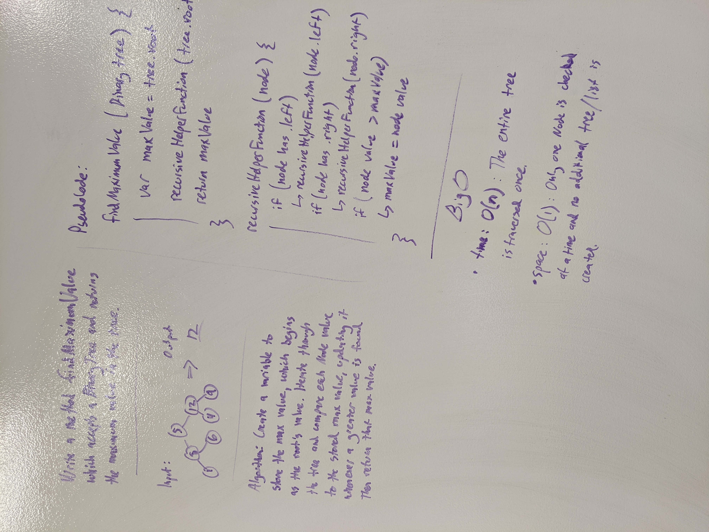

# Insertion Sort
This sorting method works by iterating through the array from left to right and maintaining a sorted, growing portion of the array until the entire array has been checked.

## Algorithm
1. Loop through the entire array.
2. Keep track of two adjacent values, starting at index 0. (j and i).
3. Store the value of i in a 'temp' variable at every loop.
4. Inside the loop, whenever j is greater than i, i is not in the correct position. To find it's proper position, loop towards index 0, moving each value to the right, until a value is found that is less than j. Then insert the temp value at j + 1.

## Pseudo Code
InsertionSort(int[] arr)
  
    FOR i = 1 to arr.length
    
      int j <-- i - 1
      int temp <-- arr[i]
      
      WHILE j >= 0 AND temp < arr[j]
        arr[j + 1] <-- arr[j]
        j <-- j - 1
        
      arr[j + 1] <-- temp

## Whiteboard step-through example
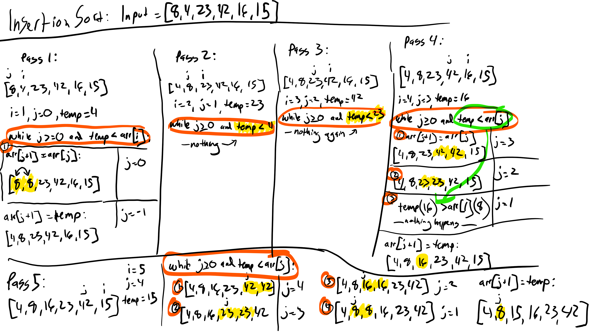

## Approach and Efficiency
This approach loops through the entire array once, with the potential to loop through the entire array again at each iteration, making it O(n squared) for time complexity. No additional data structure is created during the sort, making it O(1) for space complexity.

## Code

# Merge Sort
This sorting method works by using a helper method to recursively split the array into left and right halves until each array has a single index, then sort and combine them until the array is back to its original size.

## Algorithm
Define the recursive helper method, which
  1. Splits the input array into left and right halves
  2. Recursively splits each half using itself
  3. Uses the merge method to combine the two sorted array halves once they've been split to be one index long

Define the merge method, which
  1. Iterates through either sorted array
  2. Compares the values of each and inserts them into a new array in sorted order
  3. If either left or right is longer than the other, adds the rest of its values to the original.

## Pseudo Code
  
    ALGORITHM Mergesort(arr)
    DECLARE n <-- arr.length
           
    if n > 1
      DECLARE mid <-- n/2
      DECLARE left <-- arr[0...mid]
      DECLARE right <-- arr[mid...n]
      // sort the left side
      Mergesort(left)
      // sort the right side
      Mergesort(right)
      // merge the sorted left and right sides together
      Merge(left, right, arr)

ALGORITHM Merge(left, right, arr)
    DECLARE i <-- 0
    DECLARE j <-- 0
    DECLARE k <-- 0

    while i < left.length && j < right.length
        if left[i] <= right[j]
            arr[k] <-- left[i]
            i <-- i + 1
        else
            arr[k] <-- right[j]
            j <-- j + 1
            
        k <-- k + 1

    if i = left.length
       set remaining entries in arr to remaining values in right
    else
       set remaining entries in arr to remaining values in left

## Whiteboard step-through example
<!-- Thanks to https://www.geeksforgeeks.org/merge-sort/ for the great visual. -->
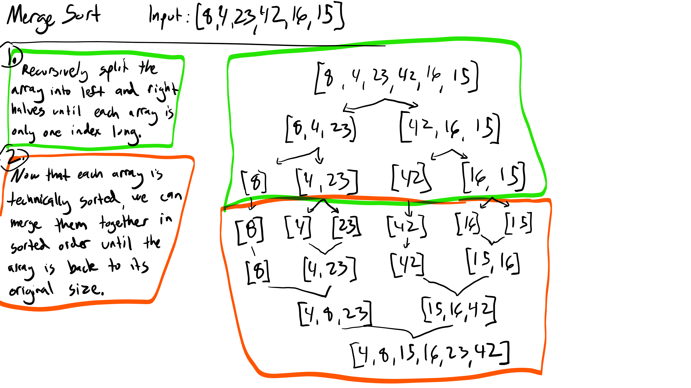

## Approach and Efficiency
This approach splits the input array in half log(n) times, creating n arrays. It then iterates over each array, combining them. The resulting time complexity is Olg(n) * (n-1), which is essentially O(n). This requires a new array to be created at every step, giving it the same space complexity, Olg(n) * (n-1), or O(n).

## Code

# Quick Sort
This sorting method works by recursively declaring a value in the array as the 'pivot' and moving all values less than the pivot into a 'left' section, and all greater values into a 'right' section, until all values have been sorted. This version uses a main method, a recurisve partitioning method, and a swap method to accomplish this.

## Algorithm
The Quicksort method accepts the array and the left and right bounds that need to be sorted. Within this method the Partition method is called to divide the array and sort via a pivot value, then this Quicksort method is recursively called on the sections of the array on each side of the pivot value. 

The Partition method takes the rightmost value in the array to use as the pivot value, uses two variables to iterate from the ends of the array towards the center, and uses the Swap method to swap values as necessary so that all values left of the pivot are less than or equal to the pivot value and vice versa.

## Pseudo Code
QuickSort(arr, left, right)
    if left < right
        // Partition the array by setting the position of the pivot value 
        DEFINE position <-- Partition(arr, left, right)
        // Sort the left
        QuickSort(arr, left, position - 1)
        // Sort the right
        QuickSort(arr, position + 1, right)

Partition(arr, left, right)
    // set a pivot value as a point of reference
    DEFINE pivot <-- arr[right]
    // create a variable to track the largest index of numbers lower than the defined pivot
    DEFINE low <-- left - 1
    for i <- left to right do
        if arr[i] <= pivot
            low++
            Swap(arr, i, low)

     // place the value of the pivot location in the middle.
     // all numbers smaller than the pivot are on the left, larger on the right. 
     Swap(arr, right, low + 1)
    // return the pivot index point
     return low + 1

Swap(arr, i, low)
    DEFINE temp;
    temp <-- arr[i]
    arr[i] <-- arr[low]
    arr[low] <-- temp

## Whiteboard step-through example
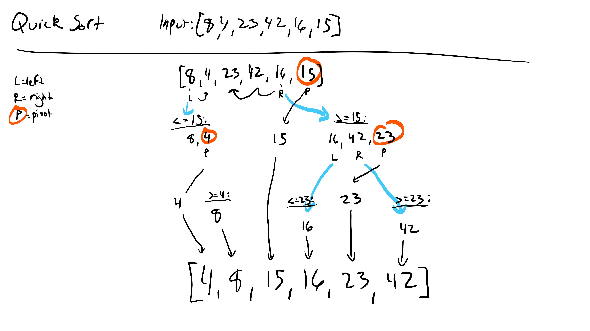

## Approach and Efficiency
This approach has a time complexity between O(n * log n) and O(n * n) depending on the pivot selected, because if the pivot is the smallest or largest value in the array, values will need to be swapped at every iteration. For the same reason it has a space complexity between O(log n) and O(n), because in the worst case a recurisve Partition method call is made at every element.

## Code

