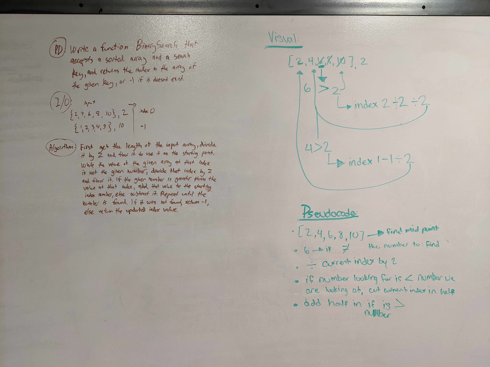

This is the repo used for the Code Fellows 301 and 401 Code Challenges.
Author: Lucas Wilber

# Reverse an Array

## Challenge
Write a Java method that takes in an array and returns the reverse.

## Approach & Efficiency
My approach was to iterate backwards over the inputted array and define the values of the new array in order with each iteration.

## Solution
[code](./code401challenges/src/main/java/code401challenges/java/ArrayReverse.java)

# Shift an Array

## Challenge
Write a function called insertShiftArray which takes in an array and the value to be added. Without utilizing any of the built-in methods available, return an array with the new value added at the middle index.

## Approach & Efficiency
My approach was to create an empty array with a length of the inputted array + 1, then iterate over it, skipping the middle index while adding the values from the inputted array, then finally setting the middle index to be the inputted value.

## Solution
[code](./code401challenges/src/main/java/code401challenges/java/ArrayShift.java)

# Array Binary Search

## Challenge
Write a function called BinarySearch which takes in 2 parameters: a sorted array and the search key. Without utilizing any of the built-in methods, return the index of the array’s element that is equal to the search key, or -1 if the element does not exist.

## Approach & Efficiency
My approach was to start at the middle by taking the input array length / 2, then begin a while-loop where I compare the value at that index to the search key and keep track of the index of comparison. If the search key wasn't found, I add or subtract half of the difference between the input array length and the tracked index value to the index value, which continuously halves the current index value while moving towards the search key. If the maximum or minimum index values are reached and the search key isn't found, I return -1;

## Solution
[code](./code401challenges/src/main/java/code401challenges/java/BinarySearch.java)

# Linked List

## Challenge
Create a linked list class, with a method that adds a new Node to the head of the list. Add methods to insert a node before and after a node with a given value, and at the end of the list. Add a method that converts the list into a string of Node values. Add a method that returns true or false if a given value exists in the Linked List.

## Approach & Efficiency
My approach inserts new nodes at the head of the list, so that inserting new nodes is O(1) rather than O(n).

## Methods

-`insert(int value)` Inserts a new Node into the Linked List 

-`includes(int input)` Checks the value of each Node in the list agains the input and returns true if found, false if not. 

-`[Node].listToString()` Prints each value of the Linked List starting at the specified Node in "{ [Node value] } -> { [next Node value] } ->..." format. Call it on the head to print the entire list.

-`append(int value)` Inserts a new Node at the end of the list.

-`insertBefore(int value, int newVal)` Uses includes() to check if `value` exists in the LL, and if it does, inserts a new Node with value `newVal` before it.

-`insertAfter(int value, int newVal)` Uses includes() to check if `value` exists in the LL, and if it does, inserts a new Node with value `newVal` after it.

## Solution
[code](./code401challenges/src/main/java/LinkedList/java/LinkedList.java)

# Linked List - kth From End

## Challenge
Write a method that, given a value `k`, finds the `k`th Node from the end of the Linked List, where the Linked List has a 0-based length.

## Approach & Efficiency
I first wrote a two-pass method that gets the length of the list on the first iteration, then iterates through again (length - k) times to arrive at the kth-from-the-end Node. I also wrote a one-pass method that creates an array of `k` length and at each iteration updates the indicies of the array to represent a segment of the last `k` values iterated over. When the loop reaches the end of the Linked List, index 0 of the array is the kth-from-the-end Node value.

## Methods

-`kthFromEnd(int k)` Returns the value of the Node `k` from the end of the Linked List. O(2n)/time, O(1) space.
-`onePassKthFromEnd(int k)` Returns the value of the Node `k` from the end of the Linked List. O(n) time, O(`k` + 1) space.

## Solution
[code](./code401challenges/src/main/java/LinkedList/java/LinkedList.java)

# Linked List - kth From End

## Challenge
Write a method that accepts two LinkedLists as arguments and merges them together in a zipper-fashion, eg (1)->(3)->(5) and (2)->(4)->(6) becomes (1)->(2)->(3)->(4)->(5)->(6).

## Approach & Efficiency
I store each Node in two variables: 'current' and 'previous', where they both are set to the list's head at first. Then, using a while loop I 

  1. advance each of the 'current' Nodes to their next node,
  
  2. set the first 'previous' Node to point to the second 'previous' Node and the second 'previous' Node to point to the first 'current' Node,

  3. set each 'previous' Node to the respective 'current' Node.

This is an O(n) time/O(1) space solution.

## Methods

-`mergeLists(LinkedList one, LinkedList two)` Zipper-merges the two lists together by moving Nodes in LL `two` into every other position in LL `one`. Returns the updated LL `one`.

## Solution
[code](./code401challenges/src/main/java/LinkedList/java/LinkedList.java)

